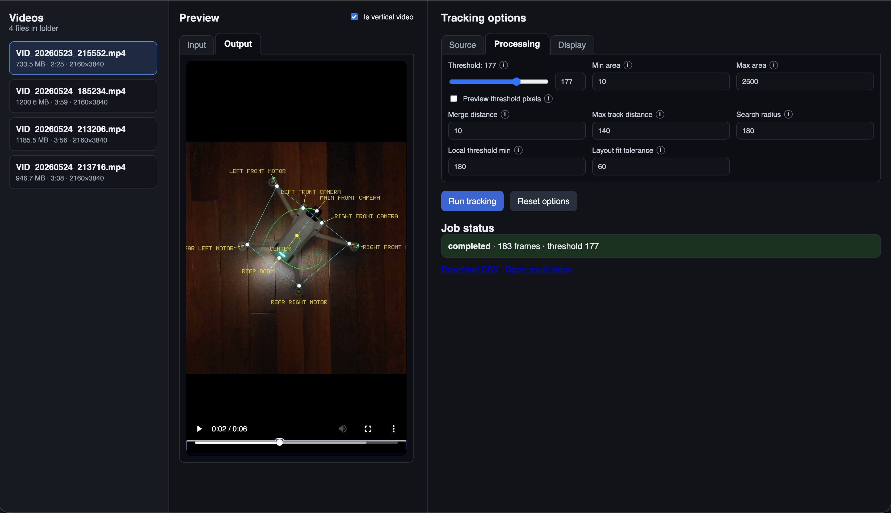

# Track Retro Markers

TypeScript CLI and local web UI for tracking bright retro-reflective markers in video footage. It detects near-white pixels whose RGB channels are all above the brightness threshold and close to each other, groups pixels into connected components, tracks marker centroids frame-to-frame, and exports both CSV data and optional visualization video.

## Screenshots




## Requirements

- Node.js 24. Use `nvm use` from this directory to pick up `.nvmrc`.
- npm

FFmpeg and FFprobe are installed through `ffmpeg-static` and `ffprobe-static`, so no system FFmpeg installation is required.

## Install

```sh
nvm use
npm install
```

## Usage

```sh
npm run track -- inputs/VID_20260523_215552.mp4 \
  --start 0 \
  --stop 10 \
  --threshold auto \
  --video overlay \
  --color white \
  --output outputs
```

```sh
node --import tsx src/cli.ts '/Users/sasha/hobby/track-retro-markers/inputs/VID_20260524_185234.mp4' \
  --trail-line-width 4 --circle-radius 12 --trail-seconds 20 --min-area 10 --merge-distance 10  \
  --color-start green --color-end blue --start 02:20 --stop 02:34  \
  --video trails --output outputs --threshold 180 \
  --markers-layout markers-layout.json --label-markers \
  --trail-markers="main front camera, center, rear body"
```

Outputs are derived from the input base name and requested time range. For the example above:

- `outputs/VID_20260523_215552_0p000-10p000_markers.csv`
- `outputs/VID_20260523_215552_0p000-10p000_overlay.mp4`

The CSV timestamp starts at zero for the analysed clip and is calculated as `frame_index / fps`.
Use `--debug-one-frame` to render only the first analysed frame as a PNG, with no CSV or video output.

## Video Modes

- `points`: black background with filled marker circles.
- `trails`: black background with marker circles and fading trails.
- `overlay`: original footage with marker circles and fading trails.
- `pixels`: black background with white pixels wherever the source pixel passes the threshold and fixed RGB balance checks.
- `copy`: original footage with no tracking visualization.
- `none`: write CSV only.

## Parameters

- `--start <time>`: start time, in seconds or `hh:mm:ss.sss`. Default: `0`.
- `--stop <time>`: stop time, in seconds or `hh:mm:ss.sss`. Default: end of video.
- `--video <mode>`: `points`, `trails`, `overlay`, `pixels`, `copy`, or `none`. Default: `overlay`.
- `--color <color>`: named color, `#rrggbb`, `#rgb`, or `r,g,b`. Used for marker circles and as the default for both trail colors. Default: `white`.
- `--color-start <color>`: newest trail color. Uses the same formats as `--color`. Default: `--color`.
- `--color-end <color>`: oldest trail color. Uses the same formats as `--color`. Default: `--color`.
- `--output <path>`: output directory or file prefix. Default: `outputs`.
- `--circle-radius <pixels>`: rendered marker radius. Default: `8`.
- `--trail-line-width <pixels>`: rendered trail line width. Default: `3`.
- `--trail-seconds <seconds>`: fade duration for trail modes. Default: `2`.
- `--trail-markers <names>`: comma-separated marker names to draw trails for in `trails` and `overlay` modes, for example `"main front camera,center"`. Default: all markers.
- `--csv-export-markers <names>`: comma-separated marker names to include in the CSV export. Default: all markers.
- `--include-csv-diff-columns`: add `diff_..._x` and `diff_..._y` CSV columns for each exported marker, measured from that marker's first exported value.
- `--threshold <value>`: `auto` or an integer from `0` to `255`. A pixel must have all RGB channels at or above this value and within the fixed internal color-spread limit. Default: `auto`.
- `--min-area <pixels>` and `--max-area <pixels>`: connected-component area filter. Defaults: `2` and `2500`.
- `--merge-distance <pixels>`: merge nearby candidate components before assigning marker centroids. Default: `35`.
- `--max-track-distance <pixels>`: maximum frame-to-frame marker assignment distance. Default: `140`.
- `--search-radius <pixels>`: automatic per-marker local search radius after the first frame. Default: `180`.
- `--local-threshold-min <value>`: lowest threshold allowed when searching around an existing track. Default: `180`.
- `--roi <left,top,right,bottom>`: rectangular region of interest where all markers are expected, using top-left and lower-right pixel coordinates. Detection, layout fitting, reacquisition, and `pixels` output are limited to this region.
- `--crop-to-roi`: crop the rendered output video to the ROI. Requires `--roi`.
- `--markers-layout <path>`: JSON layout with known marker names, coordinates, optional derived markers, and lines to draw. Extra detected blobs that do not fit the layout are ignored.
- `--use-layout-units`: scale CSV coordinates into the selected marker layout units. The scale is calculated per frame from the longest configured layout line and adds a `px_in_mm` CSV column.
- `--track-local-y-axis-angle`: add `local_y_axis_angle_degrees` to the CSV. Requires one marker with `isLocalOrigin: true` and one non-zero line with `isLocalXAxis: true`; the local Y ray points from the local X-axis line through the origin, and the angle is measured clockwise from image-space up.
- `--label-markers`: render marker names next to tracked markers. Most useful with `--markers-layout`.
- `--layout-fit-tolerance <pixels>`: maximum distance from a transformed layout marker to a detected blob while fitting the layout. Default: `60`.
- With `--markers-layout`, processing stops after 5 consecutive frames where the full layout cannot be fit. The final failed frame is written as a `pixels` debug PNG ending in `_pixels_debug.png`.
- `--debug-one-frame`: render one PNG for the first analysed frame instead of writing CSV or video output.
- `--no-progress`: disable the in-terminal progress bar (enabled by default on interactive terminals).

## Web UI

Start the backend with a folder of input videos. The UI lists those files, lets you preview and scrub them, set start/stop from the playhead, configure the same tracking options as the CLI, run processing, and play or download the results.

Use **Draw ROI** in the preview panel to drag a rectangle over the source video. The UI writes the selected source-pixel rectangle into the ROI field as `left,top,right,bottom`; use **Clear ROI** to remove it. Enable **Crop to ROI** in the display tab to crop the rendered output video to that rectangle.

The UI saves the selected video and all form values to `.track-retro-markers-ui-settings.json` as you edit, then restores them on reload. The default settings are seeded from the latest CLI-style run used during development.

Settings are split into three tabs:

- **Source**: start/stop time, ROI, and marker layout.
- **Processing**: threshold and marker detection/tracking parameters.
- **Display**: output video mode, marker colors, trail rendering, CSV marker selection, optional CSV diff columns, optional layout-unit CSV scaling, local Y-axis angle CSV output, labels, ROI cropping, and debug output.

Enable **Preview threshold pixels** next to the threshold slider to switch the preview from the video player to a one-frame `pixels` preview generated with the current threshold, fixed RGB balance check, playhead time, ROI, and processing settings.

Development (Vite dev server with API proxy):

```sh
npm run dev
```

Open `http://127.0.0.1:5173`. The dev server proxies `/api`, `/media`, and `/outputs` to the backend on port `3000`.

Production-style (single server serves built UI + API):

```sh
npm run build
npm run server -- --video-root inputs --output-root outputs --port 3000
```

Open `http://127.0.0.1:3000`.

### Server options

- `--video-root <path>`: folder containing input videos. Default: `inputs`.
- `--output-root <path>`: folder for generated CSV, MP4, and PNG files. Default: `outputs`.
- `--layout-root <path>`: folder containing marker layout JSON files listed in the UI. Default: project root (`.`).
- `--settings-path <path>`: local JSON file used to persist UI selections. Default: `.track-retro-markers-ui-settings.json`.
- `--host <address>`: bind address. Default: `127.0.0.1`.
- `--port <number>`: port. Default: `3000`.

Place videos in the video root (for example `inputs/`). Outputs are written to the output root and exposed at `/outputs/...` when a job completes.

## Development

```sh
npm run build
npm run lint
```

Scripts:

- `npm run track`: CLI tracking.
- `npm run server`: backend API and static file serving.
- `npm run web`: Vite dev server for the React UI.
- `npm run dev`: run server and web UI together.

The project uses ESLint with the `curly` rule to require braces for all control statements.
